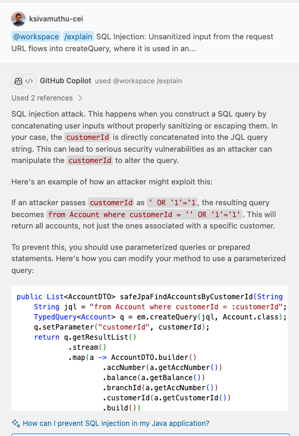
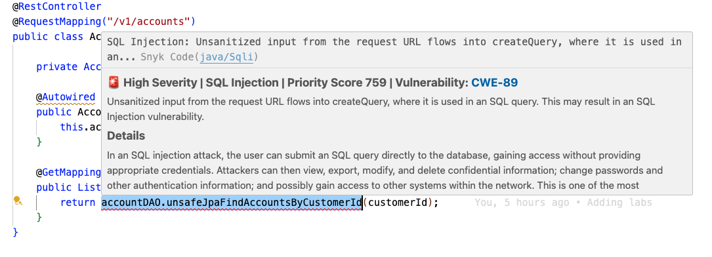
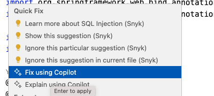
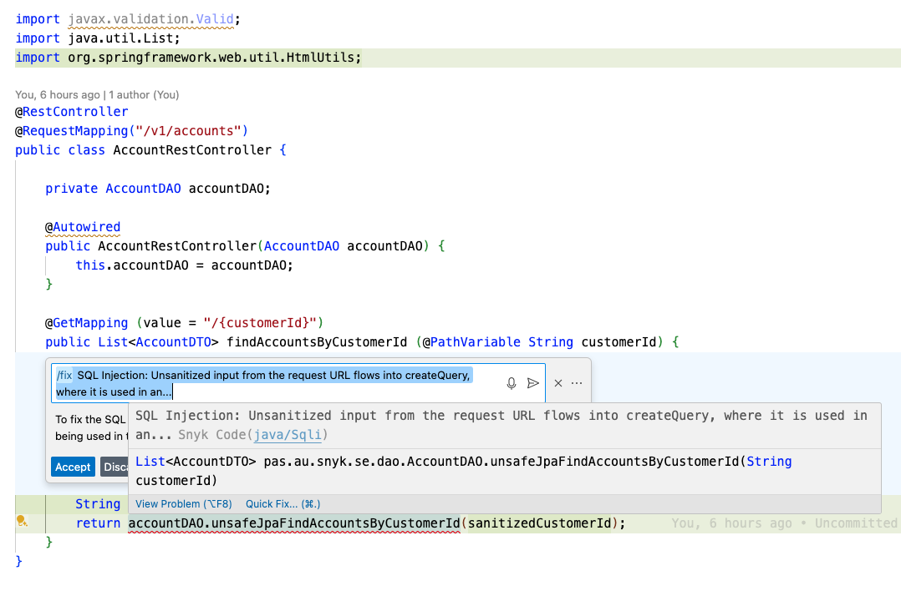
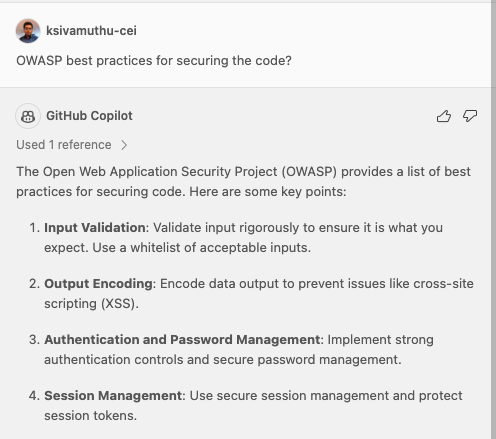
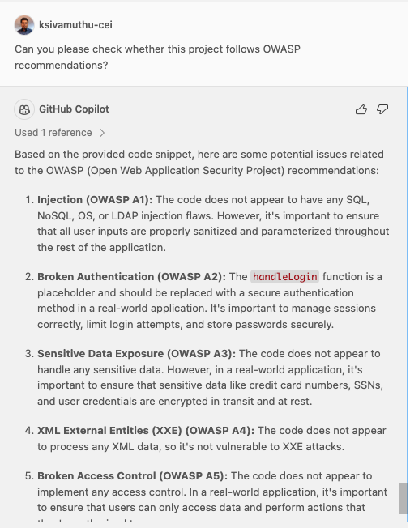

# Lab 4: Security Findings and Remediations with CodeQL

## Task 1: Understanding the Security Findings

1. Navigate through all of the security findings that CodeQL has identified in the code. One at a time, use GitHub Copilot to generate an explanation for each security finding. This explanation will help you to understand the security finding and the impact of the vulnerability.

  - **Step 1:** Click on the security finding in the code.
  - **Step 2:** Click the GitHub Copilot inline icon.
  - **Step 3:** Click `Explain using Copilot` menu in the context.
  - **Step 4:** Review the explanation generated by GitHub Copilot.



### Task 2: Fixing the Security Vulnerabilities

1. Awesome! Now that you understand the security finding, let's ask GitHub Copilot to fix the security vulnerability in the code. 

2. Select the vulnerable code snippet that you want to fix (for instance, the code snippet with the SQL injection vulnerability)



3. Click the GitHub Copilot inline icon and click `Fix using Copilot` menu in the context.



4. GitHub Copilot will suggest a fix for the security vulnerability.

  - i.e. In the case of SQL Injection vulnerability, GitHub Copilot will generate a secure code snippet to fix the SQL Injection vulnerability. The `customerId` parameter is sanitized using the `HtmlUtils.htmlEscape` method to prevent SQL Injection attacks. The fix is secure and follows the best practices for securing the code.

  

5. Once the fix generated is accepted, the CodeQL IDE immediately updates the security findings and the vulnerability is remediated in the code. 

By combining CodeQL and GitHub Copilot, the security vulnerabilities in the code is immediately identified and remediated. The GitHub Copilot can help you on fixing the security vulnerabilities in the code by generating secure code snippets and best practices for securing the code. GitHub Copilot can help you on fixing the breaking changes and compatibility issues while upgrading the packages.

## Task 3: Follow the same steps for resolving the security findings in the Java and Javascript React Application Vulnerable Code
Please try the above steps in your local environment for other security findings and see how GitHub Copilot can help you in generating secure code snippets and best practices for remediating the vulnerabilities.

## Task 4: Generating Secure Code Snippets (context-aware suggestions and Need of real-time security findings)

In addition to fixing the security vulnerabilities, Let's see whether GitHub Copilot can generate secure code snippets for securing the code.

1. Switch to the `frontend` directory and start typing the following code snippet. `<div dangerous` and see the suggestions from GitHub Copilot, auto-complete suggestions may be similar to the code snippet below.

```jsx
<div dangerouslySetInnerHTML={{ __html: userProvidedString }}></div>
```

2. The suggested code snippet is vulnerable to Cross-Site Scripting (XSS) attacks. The `dangerouslySetInnerHTML` attribute is used to render user-provided content as HTML. This is a security risk as it can lead to Cross-Site Scripting (XSS) attacks. _Why does GitHub Copilot suggest this code snippet?_

  - **Answer:** GitHub Copilot uses our context to generate suggestions, and we intentionally typed `dangerous` and `dangerouslySetInnerHTML` is a common pattern used in React applications.

4. Now with an understanding of why GitHub Copilot has provided insecure code, prompt GitHub Copilot to generate a secure code snippet:

  - **Step 1:** Select the initial suggestion from GitHub Copilot and click the GitHub Copilot inline icon
  - **Step 2:** Prompt GitHub Copilot to fix the security vulnerability: `/fix Correct the security vulnerability in the selected code`

5. GitHub Copilot will generate the escapeHtml function to sanitize the user-provided content and prevent Cross-Site Scripting (XSS) attacks: 

```jsx
<div dangerouslySetInnerHTML={{ __html: escapeHtml(userProvidedString) }}></div>

function escapeHtml(unsafe) {
  return unsafe
    .replace(/&/g, "&amp;")
    .replace(/</g, "&lt;")
    .replace(/>/g, "&gt;")
    .replace(/"/g, "&quot;")
    .replace(/'/g, "&#039;");
}

// or using DOMPurify library
function escapeHtml(unsafe) {
  return DOMPurify.sanitize(unsafe);
}
```

**NOTE:** Once the GitHub Copilot got the context of the code, it will generate the secure code snippet moving forward

```jsx
  <div dangerouslySetInnerHTML={{ __html: escapeHtml(anotherUserProvidedString) }}></div>
```

_This time, GitHub Copilot generates the secure code snippet to sanitize the user-provided content and prevent Cross-Site Scripting (XSS) attacks._

## Task 5: Learning Secure Coding Practices

In addition to generating secure code snippets, GitHub Copilot Chat can also help you learn secure coding practices.

1. Open the GitHub Copilot Chat window, and ask GitHub Copilot to explain the secure coding practices for securing the code: 

```
How to prevent SQL Injection attacks in the code?
Can you please suggest secure coding practices for authenticated sessions?
OWASP best practices for securing the code?
```


2. GitHub Copilot will generate a list of secure coding practices for securing the code based on the context of the code you are working on. This will help you to learn secure coding practices and best practices for securing the code.


3. Additionally, you can ask GitHub Copilot to recommend secure coding practices for securing the code based on your current file / project context, as shown below:



2. GitHub Copilot will generate a list of potential issues related to the recommendations

## Summary
Congratulations! You have successfully identified security findings and remediated the vulnerabilities in the code using CodeQL. You have learned how to use CodeQL to identify security findings in the code in the real time and Dependabot to update dependencies and remediate vulnerabilities. Additionally, you have learned how to ask GitHub Copilot to recommend secure coding practices for securing the code based on the context of the code you are working on.

Now that you have completed the lab, you can proceed to the next lab [Lab 5: Security Remediation Workflow with CodeQL and Dependabot](lab5-security-remediation-workflow.md) to learn more about secure coding practices and security remediation workflow with CodeQL and Dependabot.
